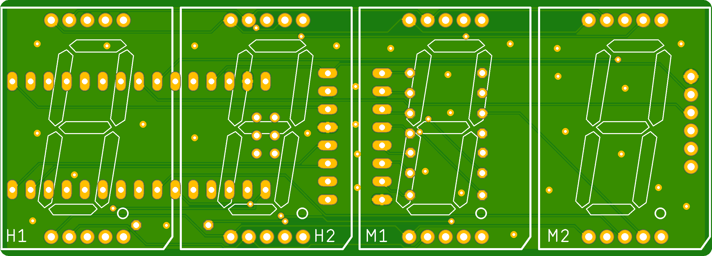
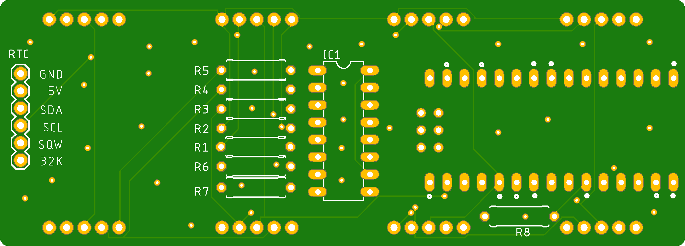
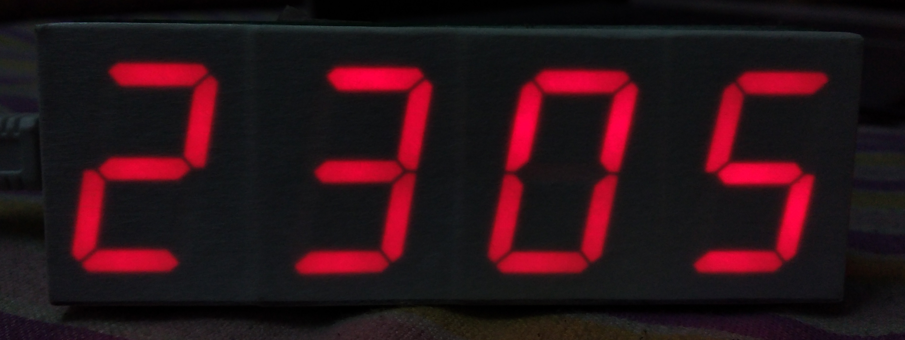

## Clock

A clock using Four, 1 inch 7 segment displays and One Shift register. Runs with an arduino Nano. 
Powered by a 5V adapter and USB Mini B cable. Uses a DS3231 RTC. 

[Credits to korolg for the Idea and Code](http://fritzing.org/projects/7-segment-led-clock-with-multiplexing)

 
 
